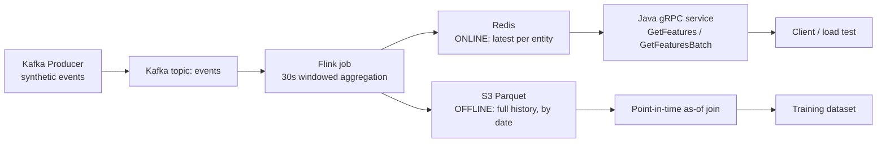

# Online/Offline Feature Store (Java)

A feature store that computes features from a streaming event source, serves them at low
latency over a **Java gRPC** API (online), and stores **point-in-time-correct** history for
model training (offline).

Synthetic events stream through **Kafka** into a **Flink** feature-computation job. The
latest feature per entity is served from **Redis** behind a **gRPC** API; the full history
lands in **S3 as Parquet** for training. As-of joins eliminate data leakage, and batching
online lookups cut serving **p99 latency ~9×** (p50 ~20×).


**Stack:** Java · Kafka · Flink · Redis · S3/Parquet · gRPC/protobuf · Docker · AWS

---

## Architecture



Two paths come out of Flink and never mix:
- **Online** (Redis → gRPC): *"what is this entity's feature right now?"* — optimized for latency.
- **Offline** (S3 → as-of join): *"what was it at time T?"* — optimized for correctness.

---

## The two hard problems

### 1. Point-in-time correctness (no data leakage)

When building training data, a label at time **T** must only see feature values that
existed **at or before T** — never a value computed afterward. Using a later value leaks the
future; the model looks great offline and fails in production.

The fix is an **as-of join** (merge-on-nearest-backward): for each label at T, attach the
most recent feature with `feature_timestamp ≤ T`. Proof from
[`pit-join/pit_join.py`](pit-join/pit_join.py) — user-1's feature changes 10.0 → 99.0 at t=200:

| entity_id | label_ts | as-of value | naive "use latest" | leaked? |
|-----------|----------|-------------|--------------------|---------|
| user-1    | 150      | **10.0** ✅ | 99.0               | yes — naive leaks the future |
| user-1    | 250      | 99.0        | 99.0               | no |

The naive join hands the t=150 label a value that didn't exist until t=200. The as-of join
gives the correct 10.0. This only stays offline: Redis keeps latest-only, so the historical
value 10.0 survives only in S3.

### 2. Online-serving latency (the N+1 lookup bottleneck)

Serving features for **K** entities the naive way means **K** separate Redis round-trips in
series — the classic N+1 problem. The fix pipelines all K lookups into a **single** round-trip.

Measured with [`LoadTest.java`](grpc-service/src/main/java/com/featurestore/grpc/LoadTest.java)
— 50 entities/batch, 2,000 iterations per mode, warmed up, timed with `System.nanoTime()`:

| mode | p50 | p99 |
|------|-----|-----|
| Before (N+1 lookups) | 6.49 ms | 11.42 ms |
| After (pipelined batch) | 0.32 ms | 1.27 ms |

**~20× faster at p50, ~9× at p99.** The round-trips were the cost — payload, gRPC framing,
and parsing are identical between the two modes, so the gap isolates exactly the fix.

---

## How to run it locally

Prerequisites: Docker, JDK 17+, Maven, AWS CLI configured (`aws configure`) with S3 access.
**Never commit AWS credentials** — they're read from your environment / AWS config and are
`.gitignore`d.

```bash
# 1. infra
docker compose up -d                 # Kafka + Redis;  redis-cli ping → PONG

# 2. stream events
cd producer && mvn -q clean package && java -jar target/producer-1.0-SNAPSHOT.jar

# 3. compute features → Redis (online) + S3 (offline)
cd flink-job && mvn -q clean package && java -jar target/flink-job-1.0-SNAPSHOT.jar

# 4. serve + benchmark
cd grpc-service && mvn -q clean package -DskipTests
java -cp target/grpc-service-1.0-SNAPSHOT.jar com.featurestore.grpc.FeatureServer   # terminal A
java -cp target/grpc-service-1.0-SNAPSHOT.jar com.featurestore.grpc.LoadTest        # terminal B

# 5. build leak-free training data
cd pit-join && python pit_join.py --demo     # PIT proof only, no AWS
                # or: python pit_join.py      # + reads S3 history → training.parquet
```

Config you'll set: the S3 bucket name (in `pit_join.py` / the Flink S3 sink) and AWS
credentials via your environment. 

---

## In production, this would…

- **Use managed Redis (ElastiCache)** instead of self-hosted, for failover and scaling; and
  **shard** to handle hot keys.
- **Scope IAM tightly** — the S3 credentials are limited to `GetObject`/`PutObject`/`ListBucket`
  on the one project bucket, not broad admin keys. An S3 lifecycle rule caps demo storage cost.
- **Pin a tested JDK** rather than run newest-Java against older Hadoop libraries — that
  mismatch caused most of the build friction (documented in the walkthrough), and a managed
  streaming service would remove it entirely.
- **Add a schema registry** for the event/feature schemas instead of ad-hoc protobuf
  versioning, plus monitoring/alerting on the gRPC service's latency.
- **Move to event-time windows with watermarks** (this demo uses processing-time for
  simplicity) so late/out-of-order events land in the correct window.

---

## What I'd do with more time

- Shard Redis and add an in-process LRU in front of it for hot entities.
- Handle schema evolution for both the event and feature records.
- Swap the processing-time windows for event-time + watermarks.


